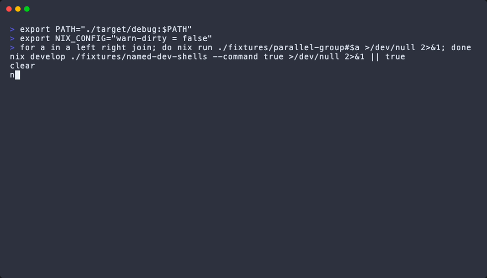

# nxr

Ergonomic runner for **standard Nix flake apps**.

`nxr test` is the pleasant form of `nix run .#test`. Optional task graphs orchestrate those apps in parallel—with labeled output, watch/restart, and named-shell execution—without replacing flakes, apps, or `nix run`.

<p align="center">
  
</p>

## Install

Put `nxr` on `PATH` from this flake (or pin it as a flake input in your project):

```bash
nix profile install github:willmortimer/nxr#nxr
# or: nix shell github:willmortimer/nxr#nxr
```

For flake-parts projects, enable session-local completion and PATH wiring:

```nix
perSystem.nxr.shellIntegration.enable = true;
# optional: perSystem.nxr.shellIntegration.devShells = [ "default" "backend" ];
```

Details: [docs/DEV_ENV_INTEGRATION.md](docs/DEV_ENV_INTEGRATION.md).

## Quick start

From any directory under a flake:

```bash
nxr list             # discover apps (+ tasks when present)
nxr list packages    # packages.<system>.*
nxr build            # ≈ nix build .
nxr check fmt        # ≈ nix build .#checks.<system>.fmt
nxr shell            # ≈ nix develop
nxr test             # ≈ nix run .#test
nxr select           # fuzzy picker
nxr plan test --json # inspect the exact Nix invocation
```

Inline flake + app (like `nix run`):

```bash
nxr ./path/to/flake#hello
nxr --flake ./path/to/flake hello
```

## Everyday commands

| Command | What it does |
|---|---|
| `nxr` / `nxr list` | List apps (and tasks) |
| `nxr list packages\|checks\|shells` | List standard flake outputs |
| `nxr build [name]` | `nix build` for a package |
| `nxr check [name]` | Build a check, or `nix flake check` |
| `nxr shell [name]` | Interactive `nix develop` |
| `nxr <app> [args…]` | Run a flake app (apps only — not tasks) |
| `nxr run <app> [-- args…]` | Explicit run form |
| `nxr task <name> [-j N]` | Run a task DAG (fail-fast; `--keep-going` opt-in) |
| `nxr graph <name>` | Print the plan (`--format text\|mermaid\|dot`) |
| `nxr watch <name>` | Kill + rerun on flake-root changes |
| `nxr plan <name>` | App plan, or task `ExecutionPlan` if not an app |
| `nxr inspect` / `doctor` | Overview and diagnostics |
| `nxr completion zsh` | Shell completion script |

Globals you’ll use often: `--flake`, `--shell <name>`, `--clean-env`, `--output live\|grouped\|failures`, `--events jsonl`.

Full index: [docs/CLI_REFERENCE.md](docs/CLI_REFERENCE.md).

### Tasks

Declare orchestration with `nxr.flakeModules.default` (`perSystem.nxr.tasks`). Tasks coordinate apps; they do not replace them.

```bash
nxr task ci
nxr task ci -j 4
nxr task ci --keep-going
nxr --output grouped task ci
nxr graph ci --format mermaid
```

Explicit commands (`task`, `graph`, `inspect task`, `watch`, task-side `plan`) resolve **aliases**. Bare `nxr <name>` stays **app-only**.

Guide: [docs/TASKS.md](docs/TASKS.md).

### Watch

```bash
nxr watch test
nxr watch ci --include 'src/**' --exclude '**/*.md' --clear
nxr run test --watch
nxr task ci --watch
```

Built-in ignores: `.git`, `target`, `result*`, `/nix/store`. Ctrl-C stops the watcher and shuts down the current generation.

### Author flake apps

Prefer self-contained apps so `nxr` / `nix run` work outside a dirty shell:

- `mkApp` / `mkScriptApp` — shell-backed apps
- `mkPackageApp` — wrap an existing package binary

See [docs/APP_AUTHORING.md](docs/APP_AUTHORING.md) and [examples/mk-app](examples/mk-app/).

Coming from `mise` / `just`? [docs/MIGRATE_FROM_MISE_JUST.md](docs/MIGRATE_FROM_MISE_JUST.md).

## Documentation

| Doc | For |
|---|---|
| [docs/CLI_REFERENCE.md](docs/CLI_REFERENCE.md) | Commands and flags |
| [docs/APP_AUTHORING.md](docs/APP_AUTHORING.md) | Writing robust flake apps |
| [docs/TASKS.md](docs/TASKS.md) | Task graphs and aliases |
| [docs/DEV_ENV_INTEGRATION.md](docs/DEV_ENV_INTEGRATION.md) | Dev shells, direnv, shellIntegration |
| [docs/COMPATIBILITY.md](docs/COMPATIBILITY.md) | Platforms and schema freeze |
| [docs/INDEX.md](docs/INDEX.md) | Full documentation map |
| [docs/CONTRIBUTING.md](docs/CONTRIBUTING.md) | Working on this repository |

## License

MIT — see [LICENSE](LICENSE).

## Status

**2.3.0** — monorepo ergonomics: namespaced `list`/`inspect` views, `nxr affected` path analysis, and optional read-only ecosystem graph adapters. History: [CHANGELOG.md](CHANGELOG.md).
