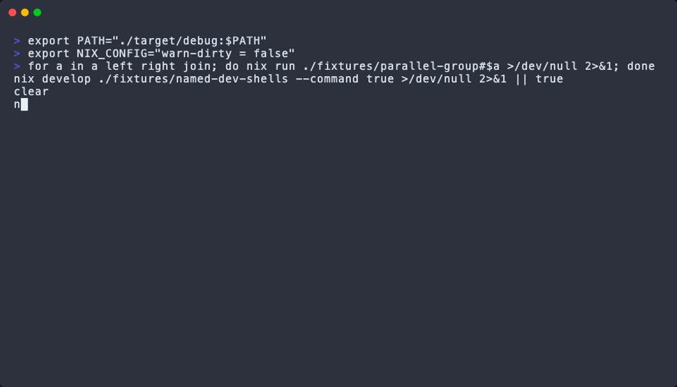

# nxr

Ergonomic command plane for **standard Nix flake outputs**.

`nxr test` is the pleasant form of `nix run .#test`. Flake apps stay the
canonical leaf operations; `nix run` remains the escape hatch. `nxr` adds
discovery, task DAGs, diagnostics, shell integration, and an operator TUI—
without becoming a second toolchain or a parallel Nix.

<p align="center">
  
</p>

**Consumer guides** live on the
[GitHub Wiki](https://github.com/willmortimer/nxr/wiki). This README is the
landing page; `docs/` is for contributors, ADRs, and the design contract.

## Install

```bash
nix profile install github:willmortimer/nxr#nxr
# or: nix shell github:willmortimer/nxr#nxr
```

Pre-built release tarballs: [docs/RELEASE.md](docs/RELEASE.md).
Step-by-step: [Wiki · Install](https://github.com/willmortimer/nxr/wiki/Install).

Flake-parts (session completion + PATH; optional schemas):

```nix
imports = [ inputs.nxr.flakeModules.default ];

perSystem.nxr = {
  shellIntegration.enable = true;
  tasks.ci = { app = "ci"; };
};
```

Details: [docs/DEV_ENV_INTEGRATION.md](docs/DEV_ENV_INTEGRATION.md),
[docs/TASKS.md](docs/TASKS.md#flake-schema-export-exportedschemasnxr).

## Quick start

```bash
nxr list                  # apps (+ tasks when present)
nxr test                  # ≈ nix run .#test
nxr task ci -j 8          # inspectable DAG; same graph locally and in CI
nxr ui                    # Apps / Tasks / Scripts browser (TTY)
nxr task ci --output tui  # Ratatui DAG watch
nxr attach                # reopen the last attachable TUI run
```

Inline flake + app (like `nix run`):

```bash
nxr ./path/to/flake#hello
nxr --flake ./path/to/flake hello
```

## Operator TUI

| Command | What it does |
|---|---|
| `nxr ui` | Lazygit-style browser; Enter runs apps / `task --output tui` / scripts |
| `nxr … --output tui` | One-screen DAG watch (node table + log tail); non-TTY falls back to `live` |
| `nxr attach [RUN]` | Reopen a recorded watch (omit `RUN` → most recent; fail closed if none) |

More: [Wiki · Interactive TUI](https://github.com/willmortimer/nxr/wiki/Interactive-TUI),
[ADR-0173](docs/adr/0173-operator-tui.md). Demo GIFs:
[tui](docs/demo/nxr-tui.gif) · [ui](docs/demo/nxr-ui.gif) ·
[wizard](docs/demo/nxr-wizard.gif).

Decision-style flows stay **wizard flake apps → `nxr task …`** (no schema
`when`). See [fixtures/deploy-wizard](fixtures/deploy-wizard/) and
[Wiki · Tasks and DAGs](https://github.com/willmortimer/nxr/wiki/Tasks-and-DAGs).

## Everyday commands

| Command | What it does |
|---|---|
| `nxr` / `nxr list` | List apps (and tasks) |
| `nxr <app> [args…]` | Run a flake app (apps only — not tasks) |
| `nxr task <name>… [-j N]` | Run task roots (union DAG; shared deps once) |
| `nxr script <path\|name>` | Local workspace script (`.nxr/scripts/` or path) |
| `nxr graph <name>` | Print the plan (`--format text\|mermaid\|dot`) |
| `nxr watch <name>` | Kill + rerun on flake-root changes |
| `nxr plan` / `explain` | Exact Nix argv, cwd, cache key, capabilities |
| `nxr doctor --all` | Environment + workspace findings |
| `nxr affected …` | Conservative path→app/task analysis for CI |
| `nxr ci plan [--json]` | Provider-neutral CI execution plan |
| `nxr migrate justfile\|mise` | Suggest `perSystem.nxr.*` (never runs recipes) |

Useful globals: `--flake`, `--cwd` / `--root`, `--shell` / `--shell-mode`,
`--output live|grouped|failures|summary|raw|tui`, `--events jsonl`.

Full CLI index: [docs/CLI_REFERENCE.md](docs/CLI_REFERENCE.md).

### Tasks and CI ≡ local

```bash
nxr task ci
nxr task lint unit integration -j 8
nxr graph release --format mermaid
nxr ci plan --json
```

Guide: [Wiki · Tasks and DAGs](https://github.com/willmortimer/nxr/wiki/Tasks-and-DAGs),
[docs/TASKS.md](docs/TASKS.md).
CI/release walkthrough:
[Wiki · CI and Release](https://github.com/willmortimer/nxr/wiki/CI-and-Release).

### Coming from mise / just

```bash
nxr migrate mise
nxr migrate justfile
```

[Wiki · Migrations](https://github.com/willmortimer/nxr/wiki/Migrations) ·
[docs/MIGRATE_FROM_MISE_JUST.md](docs/MIGRATE_FROM_MISE_JUST.md).

## Documentation map

| Audience | Where |
|---|---|
| **Users** | [GitHub Wiki](https://github.com/willmortimer/nxr/wiki) (Install, Tasks, TUI, CI, Migrations) |
| **Contributors / agents** | [docs/INDEX.md](docs/INDEX.md), [CONTRACT_SUMMARY](docs/CONTRACT_SUMMARY.md), [ADRs](docs/adr/README.md) |
| **This repo** | [docs/CONTRIBUTING.md](docs/CONTRIBUTING.md), [docs/RELEASE.md](docs/RELEASE.md) |

Wiki source markdown (publish with `./scripts/publish-wiki.sh`): [`wiki/`](wiki/).

## Developing this repository

```bash
nxr task ci          # host: fmt-check → lint → test → deny → cli-ref
nxr task ci-linux    # Linux OS parity (OrbStack/Docker; native on Linux)
nxr task release     # dependsOn [ci, ci-linux], then tag helper
```

## License

MIT — see [LICENSE](LICENSE).

## Status

**3.5.3** (tagged) — floor-Nix discovery/store-exe fixes; workspace scripts,
materialized process envs, typed parameters/matrices, nom-style Nix progress.
**Unreleased** on `sprint/operator-ergonomics`: `--output tui`, `nxr attach`,
`nxr ui`, OSC 52 failure clipboard, deploy-wizard fixture.

History: [CHANGELOG.md](CHANGELOG.md) · roadmap: [docs/ROADMAP.md](docs/ROADMAP.md).
